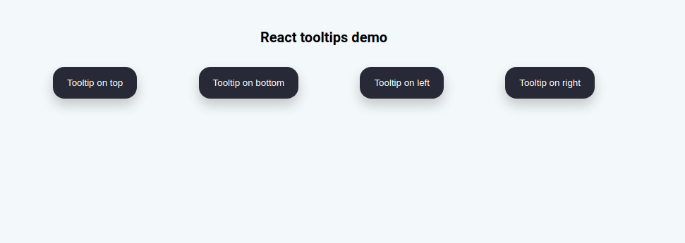

# Exo Unkle

Exo chez Unkle


## Frontend exo

Create component reusable React Tooltip.

There are two choices of languages to start working with this exercise: JavaScript & TypeScript. Because It is a simple component with not many line of code. So I thinks work directly with Javascript will be much faster.

But I think it will be more interesting if I convert this component to npm package. So finally I choose work directly with TypeScript because its strong type.


So how I created this tooltip component? `directly method` & `npm package method`

- Directly tooltips component in react project:
  - First of all, I worked directly with React framework Vitejs (It's very fast compile & build, much much better than using react-script). And I create tooltip components directly in this project.
  - You can find the final work of this project at branch: [frontend-ts](https://github.com/tienduy-nguyen/exo-unkle)
  - If you want to run this branch in development, you can follow some simple steps:
  
    Clone repository:  [exo-unkle](https://github.com/tienduy-nguyen/exo-unkle) and run it locally

    ```bash
      $ git clone https://github.com/tienduy-nguyen/exo-unkle
      $ cd exo-unkle
      # create local brand & switch to it
      $ git checkout -b frontend-ts
      # pull code of this branch from branch github
      $ git pull origin frontend-ts

      # un project
      $ cd frontend-ts
      $ yarn install
      $ yarn dev
    ```
    

- Npm package: `td-react-tooltip`
  
  I just showed how I created the tooltip component directly in React Project. Now, I use `rollup package` to convert and publish this components to become a `npm package`.

  The source code is directly on [main branch](https://github.com/tienduy-nguyen/exo-unkle). 

  How to use?
  
  - Installation: 
    ```ts
    $ yarn install td-react-tooltip
    # or
    $ npm i td-react-tooltip
    ```

  - Import in your projects
    ```ts
    import Tooltip from 'td-react-tooltip';

    export function App = ()=>{
      return(
        <>
          <div className="App">
            <Tooltip
              content="Hi, I'm a tooltip on top"
              direction="top"
              delay={0}
              background="#27ae60"
            >
              <button className="btn">Tooltip on top</button>
            </Tooltip>
          </div>

        </>
      )
    }
    ```

  - Options of tooltips
    - content (*): Text display for tooltip
    - direction (*): position of tooltip box: `top - bottom - right - left`
    - delay: Time delay en millisecond before displaying (time default `0` ms)
    - background: background of tooltip box (color default `black` - #333)
    - color: color of text, color default `white`
    - fontSize: default `1rem`

  - You can also check [my project example](https://github.com/tienduy-nguyen/exo-unkle/tree/main/npm-tooltip/example)

  Still missing testing. 

## Backend exo

### Database design
  

  - By default of this exercise, we have 3 tables principles: users, contracts and options
  - Table users has 2 different types: `admin` & `client`
  - Why I have two join tables more?

    Because 1 `client` has many `contracts`, 1 contract has many `clients` (N-N relationship)and the same for `options` and `contracts` table (N-N). So I think the best way to handle relationship (read, write) between these tables is creating the join tables for them.

    In rails active record association, we have a type `has_and_belongs_to_many` to resolve many-to-many relationship, but working directly with an join table make always the life easier. 

### Routes
